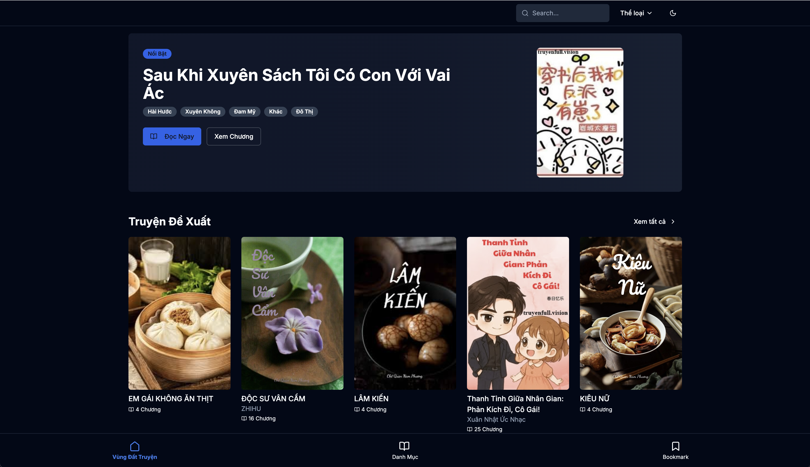

# Mô tả chi tiết về Repository "Vùng Đất Truyện"

## Mục đích và Chức năng

"Vùng Đất Truyện" là một nền tảng web chuyên dụng để đọc truyện/tiểu thuyết trực tuyến. đọc truyện hiện đại và responsive với các tính năng phong phú cho người dùng.

## 🌐 Demo

Explore the live demo here: [**Live Demo**](https://vungdattruyen.asia/)

## Kiến trúc Hệ thống

### Kiến trúc Frontend

Dự án được xây dựng trên nền tảng **Astro v5.3.0** kết hợp với **React v19.0.0**, sử dụng mô hình SSG (Static Site Generation) và SSR (Server-Side Rendering).

### Cấu trúc Thư mục

- **src/pages/**: Quản lý routing với trang chủ, trang chi tiết sách, và trang đọc chương
- **src/components/**: Chứa các UI components được tổ chức theo modules
- **src/lib/**: Quản lý logic nghiệp vụ, API, và utilities

### Hệ thống Cache và Middleware

Ứng dụng triển khai một hệ thống cache thông minh với strategy "stale-while-revalidate" để tối ưu hiệu suất. dụng cho cả dữ liệu API và HTML response với thời gian cache 60 giây.

## Các Tính năng Chính

### 1. Trang Chủ và Khám Phá Nội dung

Trang chủ hiển thị các section chính:

- **Truyện Đề Xuất**: Danh sách các truyện được gợi ý
- **Mới Cập Nhật**: Các truyện vừa được cập nhật chương mới
- **Đọc Nhiều Nhất**: Các truyện phổ biến nhất

### 2. Trang Chi tiết Truyện

Cung cấp thông tin chi tiết về từng truyện bao gồm:

- Ảnh bìa, tiêu đề, tác giả
- Thông tin trạng thái hoàn thành/đang cập nhật
- Danh sách chương
- Tính năng bookmark/lưu truyện

### 3. Trải nghiệm Đọc Truyện

Trang đọc được tối ưu với:

- Định dạng prose typography cho trải nghiệm đọc tốt
- Navigation giữa các chương
- Sticky header với các nút điều hướng

### 4. Hệ thống Phân loại và Tìm kiếm

- Phân loại truyện theo thể loại
- Tích hợp Pagefind cho tính năng tìm kiếm

## Công nghệ Sử dụng

### Frontend Framework và Libraries

- **Astro v5.3.0**: Framework chính cho SSG/SSR
- **React v19.0.0**: Để xây dựng interactive components
- **TypeScript v5.7.2**: Đảm bảo type safety

### Styling và UI

- **Tailwind CSS v3.4.15**: CSS framework chính
- **DaisyUI v5.0.42**: Component library bổ sung
- **Radix UI**: Headless components cho accessibility
- **Lucide React**: Icon library

### SEO và Performance

- **Astro Sitemap**: Tự động tạo sitemap
- **Astro RSS**: Hỗ trợ RSS feeds
- **Sharp**: Tối ưu hình ảnh

### Utilities và Tools

- **Date-fns và Dayjs**: Xử lý thời gian
- **Cheerio**: Parse HTML
- **Reading-time**: Tính toán thời gian đọc

## Tích hợp Backend API

Ứng dụng kết nối với backend API thông qua các environment variables:

- **SITE_API_URL**: URL của backend API
- **SITE_AUTH_TOKEN**: Token xác thực

### Các API Endpoints chính:

- `/book`: Lấy dữ liệu trang chủ và danh sách truyện
- `/book/categories`: Lấy danh sách thể loại
- `/book/adsense`: Quản lý quảng cáo

## Deployment và Production

Dự án được containerized với Docker sử dụng multi-stage build:

- **Stage 1**: Build ứng dụng với Node.js Alpine
- **Stage 2**: Runtime với image tối ưu

## Data Models

Hệ thống định nghĩa các type chính:

- **BookItem**: Thông tin chi tiết về truyện
- **Chapter**: Thông tin chương truyện
- **CategoryItem**: Thông tin thể loại

## Notes

"Vùng Đất Truyện" là một ứng dụng web hiện đại được thiết kế chuyên biệt cho việc đọc truyện trực tuyến, với kiến trúc scalable, tối ưu SEO và trải nghiệm người dùng. Dự án kết hợp khéo léo giữa static generation và server-side rendering để đảm bảo hiệu suất cao và khả năng tương tác tốt.
